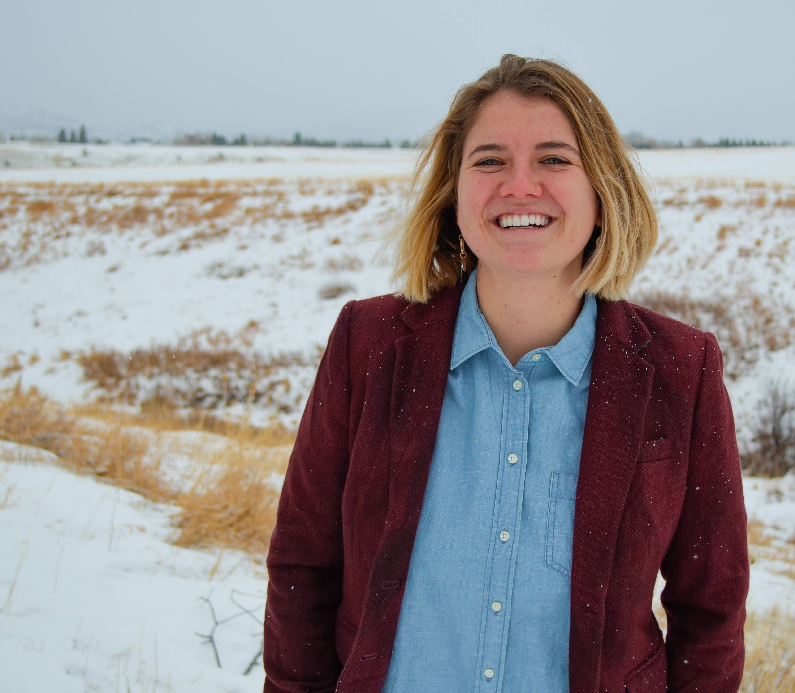
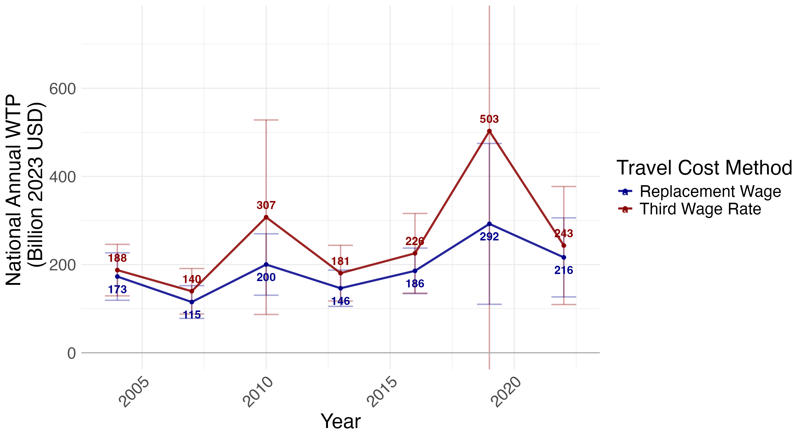
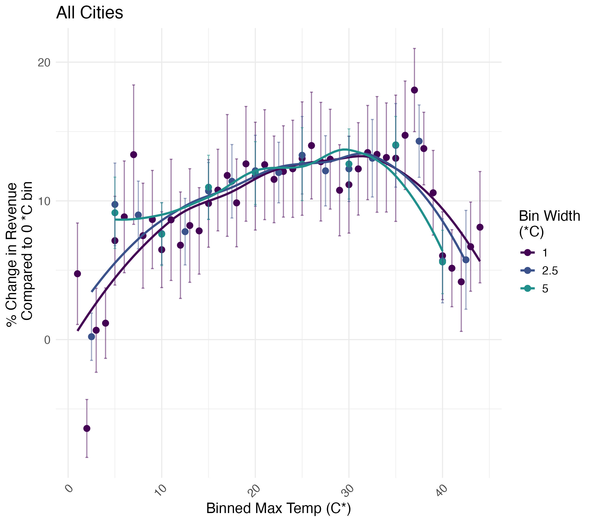

# Andie Creel 

  
  

    I am a Ph.D. candidate in Environmental Economics at The Yale School of the Environment. My research focuses on non-market valuation, with particular interest in developing new environmental economic statistics at the national scale. I will be on the job market in 2025-2026.
  

## Contact Information 
- Email: andie.creel@yale.edu
- [LinkedIn](https://www.linkedin.com/in/andie-creel/)

## Research

### Job Market Paper: Do Hot Deals Beat the Heat? Does Green Space Keep Bringing in the Green? The Effects of Heat and Green Space on City Storefronts

  
  

    I investigate the impact of extreme heat and green space on business revenue in urban areas. Using a novel dataset that integrates storefront spending, local temperature, and green space data from 2019 to 2024, I find that daily revenue peaks at around 35°C (95°F). An increase from 35°C to 40°C (104°F) reduces revenue from a 15% increase above baseline to a 5% increase. Green space mitigates the negative effects of extreme heat, especially within 200 meters of a storefront. I also project revenue changes under different climate scenarios and evaluate the potential for urban green space investments to offset economic damages from climate change. This work contributes to understanding the economic impacts of climate change and the value of nature-based solutions.
  

### 20 Years of Changing Willingness to Pay for Local Outdoor Recreation

  
  

    I estimate the benefits of local outdoor recreation over time and across different sub-populations using data from the American Time Use Survey (2003-2023). I find that the average willingness to pay (WTP) for a local outdoor recreation trip is $18 to $23 in 2023 USD, with notable increases during the 2008 financial crisis and the 2020 COVID-19 pandemic. National annual WTP has increased from $173-$188 billion in 2004 to $216-$243 billion in 2022, driven by more trips per year and population growth. Additionally, I revisit travel cost models, proposing a replacement wage approach to better reflect opportunity costs, which reduces disparities in WTP across income quintiles, aligns with national economic statistics, and is more theoretically founded.
  

