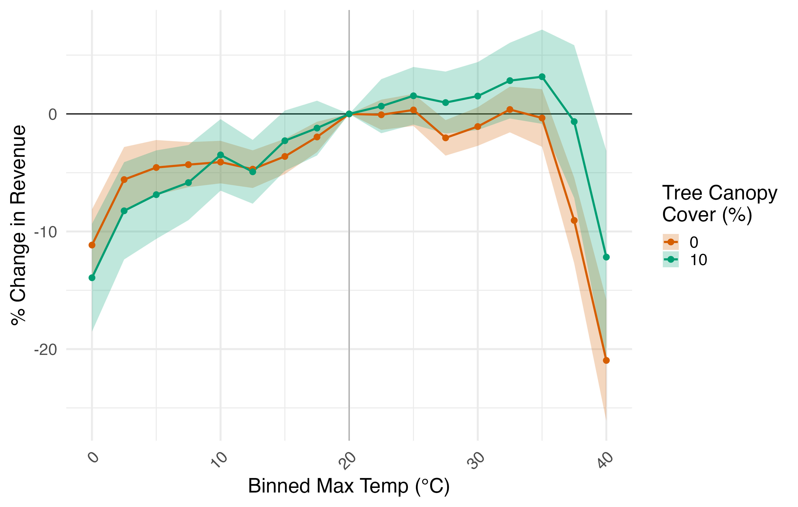

    

# Andie M. Creel 
I am a Ph.D. candidate in Environmental Economics at the Yale School of the Environment. My research develops large-scale empirical measures of the economic value of natural capital and ecosystem services, measuring values often missing from traditional statistics because nature is not bought or sold in markets. By combining revealed preference methods with novel datasets such as credit card transactions, mobility data, and high-resolution environmental measures, I quantify how environmental benefits and costs vary across time, space, and demographic groups.

My job market paper shows how urban green space buffers the economic damages of extreme heat on storefront revenue, reframing trees from a public amenity into a productive asset that can “self-finance” through municipal tax bases. More broadly, my agenda examines how businesses capitalize on natural resources, how people rely on environmental amenities for welfare, and how these relationships can be incorporated into fiscal systems and national accounts. This work informs resource management strategies that promote sustainability, expand equitable access to environmental benefits, and support nature-based climate adaptation.

I will be on the job market in 2025-2026.

- [View and Download CV](creel_cv.pdf)
- [andie.creel@yale.edu](mailto:andie.creel@yale.edu)
- [LinkedIn](https://www.linkedin.com/in/andie-creel-7552b9b1/)

# Research

## *Job Market Paper*: Revenue Under Heat: The Value of Urban Green Space

Extreme heat is becoming more frequent and intense due to climate change, particularly in urban areas where the heat island effect amplifies high temperatures. This paper estimates the causal effect of temperature on daily revenue at over 15,000 consumer-facing storefronts in the 53 largest U.S. metro areas between 2019 and 2023, with a focus on how green space can mitigate revenue loss caused by extreme heat. I find that revenue begins to decline on days with a maximum temperature above 35 °C (95 °F) and drops by 10 percent on days above 37.5 °C (99.5 °F) relative to the average revenue on a 20 °C (68 °F) day. Substituting spending across days mitigates some damage from an extreme heat event, but a 1.3 percent revenue drop is persistent for two weeks following an extremely hot day. Because temporal substitution does not completely mitigate the negative effect of extreme heat, I examine the role of urban green space as a climate adaptation strategy. Using variation in greenery around storefronts belonging to the same brand within a city, I find that a 1 percent increase in surrounding green space raises revenue by 1.9 percent on extremely hot days: 1.1 percent from general amenity value and 0.8 percent from its cooling effect. These results suggest that green infrastructure can improve firm resilience to heat, providing evidence of a private incentive to finance public urban green space that could simultaneously provide a positive externality. 

## 20 Years of Changing Willingness to Pay for Local Outdoor Recreation

\[[Link to Working Paper.](working_papers/creel_local_recreation.pdf)\] I measure the benefits of local outdoor recreation in the United States over 2003-2023 and show how conclusions depend on how travel time is priced. Using the American Time Use Survey to estimate a travel-cost model, I estimate (i) welfare-based willingness to pay, which values travel time at one-third of own wage, and (ii) accounting values that price the realized service (travel) at a replacement wage consistent with household production accounts. Average value per trip is stable at roughly $15-$18 (2023 USD) regardless of pricing technique, with temporary increases around the Great Recession and the COVID-19 pandemic. Scaling by trips and population, national annual value rises by about $100 billion over two decades. In 2022, it totals $216-$241 billion, far exceeding typical municipal park investments. In contrast to average and aggregated value, distributional results depend on the modeling choice of how to price time. While aggregate time trends are similar under both approaches, using a replacement wage compresses the richest-to-poorest quintile ratio in per-trip value from about 10:1 to 1.5:1. The method produces a scalable, repeatable measure of local recreation benefits and connects non-market valuation with accounting-consistent pricing. 

